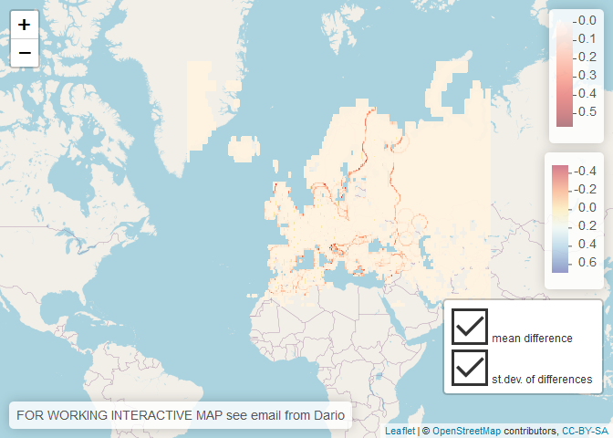

New blending procedure
================

**Too long; didn't read (TL;DR): the blending procedure translated to py performs well enough compared to the original NCL one.** Recalculate of past data is not necessary for these reasons: \* the values are extremely close to the former version, thus trivial to do \* the methodology has not changed \* the purpose of this indicator in gdo is monitoring and is meaningful on its own, it's not made for comparison across time (but rather across space, if anything). But again, differences are tiny. \* The blending it's not affecting the underlying data, it's

There are also good reasons to recalculate: \* make things technically consistent and exatcly reproducible, it is "more correct" \* Launching recalculation it probably takes less time than writing these pros and cons!

I have tested the last 2 years of monthly updates for different SPI periods. Subtracting the new procedure output with the existing data then looking at deltas. Below they are aggregated, since no relevant difference are found among periods or months.

-   delta was made cell by cell, for each month and period
-   I did not make statistical tests (i guess a bunch of t-tests could provide that, but trivial i think), nor I dwelt into any month by month analysis (knowing that any is at least 96% equal to the second decimal sufficed).
-   the differences are at the boundary between the search radius around stations and gpcc raw data. I can't have a clue about that since could not get to the source code of a key function in ncl. Nor I want that, no reason to believe that the python version is more wrong than the previous. It's time consuming and trivial at this level of accuracy.

<!-- -->

    ## Loading required package: sp

    ## [1] "within +/- 0.5"
    ##    Min. 1st Qu.  Median    Mean 3rd Qu.    Max. 
    ##  0.9934  0.9984  0.9991  0.9988  0.9995  0.9999 
    ## [1] "within +/- 0.1"
    ##    Min. 1st Qu.  Median    Mean 3rd Qu.    Max. 
    ##  0.9763  0.9880  0.9901  0.9896  0.9913  0.9952 
    ## [1] "within +/- 0.01"
    ##    Min. 1st Qu.  Median    Mean 3rd Qu.    Max. 
    ##  0.9548  0.9718  0.9764  0.9746  0.9788  0.9841

The summary shows that the vast majority of values (about 97%) falls within plus minus 0.01 compared to old NCL version). I did investigate the outlier date that seem to perform worse, see below.

### What about extreme SPI values?

*The new procedure smoothes slightly more the extremes* Below I removed all SPI between +/- 1 and fitted a linear model of original vs new data for the worst performing date tested (2019-05-01). The model ideally should return y = x. The actual model correctly has intercept close to zero and slope close to 1:

    ## 
    ## Call:
    ## lm(formula = getValues(frr) ~ getValues(fr))
    ## 
    ## Coefficients:
    ##   (Intercept)  getValues(fr)  
    ##     -0.001757       0.997809

Residuals show some pattern (upper left), but for a small num of records overall. qq plot shows heavy tails (upper right): the more extreme, the more departure from zero difference. However these values are more and more rare departing from zero, by definition. Also in a classified map they won't show such differences. Data seems slightly heteroskedastic (lower left), but just because of not many values at extremes and a slight non linearity is detected. Basically no outliers are detected (lower right), nor any influences the model (i.e. the previous are reliable).

Modelling the differences (not shown) shows very small slope, not equal to zero as it should but close, and negligible given the limited range of values SPI take. also intercept is very close to zero, as it should.

    ## 
    ## Call:
    ## lm(formula = md ~ mfr)
    ## 
    ## Residuals:
    ##      Min       1Q   Median       3Q      Max 
    ## -0.53829 -0.00512 -0.00413  0.00116  0.97548 
    ## 
    ## Coefficients:
    ##              Estimate Std. Error t value Pr(>|t|)    
    ## (Intercept) 0.0017572  0.0002680   6.557 5.65e-11 ***
    ## mfr         0.0021906  0.0001683  13.014  < 2e-16 ***
    ## ---
    ## Signif. codes:  0 '***' 0.001 '**' 0.01 '*' 0.05 '.' 0.1 ' ' 1
    ## 
    ## Residual standard error: 0.0357 on 18364 degrees of freedom
    ##   (77106 observations deleted due to missingness)
    ## Multiple R-squared:  0.009138,   Adjusted R-squared:  0.009084 
    ## F-statistic: 169.4 on 1 and 18364 DF,  p-value: < 2.2e-16

### map of deltas

The map shows standard deviation and average of all deltas, aggregated regardless periods and months. You can see that at the boundary of the search radius of the blending algorithms there are the wider differences. It is difficult to track back the source of difference, because I cannot find the original code for a key function.

summary month by month
----------------------

Number of cells with values of **difference** (not SPI value) beyond +/- 1. Summary and boxplot below refer to the full sample of 120 months/SPI combos

    ##    Min. 1st Qu.  Median    Mean 3rd Qu.    Max. 
    ##   0.000   2.000   4.000   5.642   8.250  20.000

Below follows month by month analysis with proportion of cells within 3 tolerance levels (ignore missing values), number of cells beyond +/- 1 and the summary of all cells for a month

    ## [1] "Month: 2018 04  -- SPI 01"
    ## [1] "difference within +/- 0.5 0.999"
    ## [1] "difference within +/- 0.1 0.989"
    ## [1] "difference within +/- 0.01 0.972"
    ## [1] "Num. of cells with difference beyond +/- 1 ->  2 out of  57760"
    ##    Min. 1st Qu.  Median    Mean 3rd Qu.    Max.    NA's 
    ##   -1.93    0.00    0.00    0.00    0.00    0.93   37712 
    ## [1] "------------"
    ## [1] "Month: 2018 05  -- SPI 03"
    ## [1] "difference within +/- 0.5 0.999"
    ## [1] "difference within +/- 0.1 0.988"
    ## [1] "difference within +/- 0.01 0.97"
    ## [1] "Num. of cells with difference beyond +/- 1 ->  2 out of  58368"
    ##    Min. 1st Qu.  Median    Mean 3rd Qu.    Max.    NA's 
    ##   -0.85    0.00    0.00    0.00    0.00    1.09   37104 
    ## [1] "------------"
    ## [1] "Month: 2018 06  -- SPI 06"
    ## [1] "difference within +/- 0.5 0.999"
    ## [1] "difference within +/- 0.1 0.986"
    ## [1] "difference within +/- 0.01 0.969"
    ## [1] "Num. of cells with difference beyond +/- 1 ->  1 out of  58704"
    ##    Min. 1st Qu.  Median    Mean 3rd Qu.    Max.    NA's 
    ##   -0.98    0.00    0.00    0.00    0.00    1.14   36768 
    ## [1] "------------"
    ## [1] "Month: 2018 07  -- SPI 12"
    ## [1] "difference within +/- 0.5 0.999"
    ## [1] "difference within +/- 0.1 0.986"
    ## [1] "difference within +/- 0.01 0.97"
    ## [1] "Num. of cells with difference beyond +/- 1 ->  6 out of  58720"
    ##    Min. 1st Qu.  Median    Mean 3rd Qu.    Max.    NA's 
    ##   -1.41    0.00    0.00    0.00    0.00    1.37   36752 
    ## [1] "------------"
    ## [1] "Month: 2018 08  -- SPI 48"
    ## [1] "difference within +/- 0.5 0.998"
    ## [1] "difference within +/- 0.1 0.986"
    ## [1] "difference within +/- 0.01 0.97"
    ## [1] "Num. of cells with difference beyond +/- 1 ->  11 out of  58672"
    ##    Min. 1st Qu.  Median    Mean 3rd Qu.    Max.    NA's 
    ##   -1.25    0.00    0.00    0.00    0.00    1.30   36800 
    ## [1] "------------"
    ## [1] "Month: 2018 09  -- SPI 01"
    ## [1] "difference within +/- 0.5 0.999"
    ## [1] "difference within +/- 0.1 0.987"
    ## [1] "difference within +/- 0.01 0.97"
    ## [1] "Num. of cells with difference beyond +/- 1 ->  5 out of  56432"
    ##    Min. 1st Qu.  Median    Mean 3rd Qu.    Max.    NA's 
    ##   -1.24    0.00    0.00    0.00    0.00    2.15   39040 
    ## [1] "------------"
    ## [1] "Month: 2018 10  -- SPI 03"
    ## [1] "difference within +/- 0.5 0.999"
    ## [1] "difference within +/- 0.1 0.985"
    ## [1] "difference within +/- 0.01 0.969"
    ## [1] "Num. of cells with difference beyond +/- 1 ->  2 out of  58496"
    ##    Min. 1st Qu.  Median    Mean 3rd Qu.    Max.    NA's 
    ##   -1.05    0.00    0.00    0.00    0.00    0.77   36976 
    ## [1] "------------"
    ## [1] "Month: 2018 11  -- SPI 06"
    ## [1] "difference within +/- 0.5 0.998"
    ## [1] "difference within +/- 0.1 0.985"
    ## [1] "difference within +/- 0.01 0.969"
    ## [1] "Num. of cells with difference beyond +/- 1 ->  20 out of  58704"
    ##    Min. 1st Qu.  Median    Mean 3rd Qu.    Max.    NA's 
    ##   -3.02    0.00    0.00    0.00    0.00    1.15   36768 
    ## [1] "------------"
    ## [1] "Month: 2018 12  -- SPI 12"
    ## [1] "difference within +/- 0.5 0.999"
    ## [1] "difference within +/- 0.1 0.984"
    ## [1] "difference within +/- 0.01 0.968"
    ## [1] "Num. of cells with difference beyond +/- 1 ->  2 out of  58720"
    ##    Min. 1st Qu.  Median    Mean 3rd Qu.    Max.    NA's 
    ##   -1.03    0.00    0.00    0.00    0.00    1.06   36752 
    ## [1] "------------"
    ## [1] "Month: 2019 01  -- SPI 48"
    ## [1] "difference within +/- 0.5 0.998"
    ## [1] "difference within +/- 0.1 0.985"
    ## [1] "difference within +/- 0.01 0.968"
    ## [1] "Num. of cells with difference beyond +/- 1 ->  9 out of  58640"
    ##    Min. 1st Qu.  Median    Mean 3rd Qu.    Max.    NA's 
    ##   -0.97    0.00    0.00    0.00    0.00    1.49   36832 
    ## [1] "------------"
    ## [1] "Month: 2019 02  -- SPI 01"
    ## [1] "difference within +/- 0.5 0.999"
    ## [1] "difference within +/- 0.1 0.987"
    ## [1] "difference within +/- 0.01 0.971"
    ## [1] "Num. of cells with difference beyond +/- 1 ->  4 out of  58272"
    ##    Min. 1st Qu.  Median    Mean 3rd Qu.    Max.    NA's 
    ##   -1.61    0.00    0.00    0.00    0.00    0.73   37200 
    ## [1] "------------"
    ## [1] "Month: 2019 03  -- SPI 03"
    ## [1] "difference within +/- 0.5 0.999"
    ## [1] "difference within +/- 0.1 0.987"
    ## [1] "difference within +/- 0.01 0.972"
    ## [1] "Num. of cells with difference beyond +/- 1 ->  1 out of  58656"
    ##    Min. 1st Qu.  Median    Mean 3rd Qu.    Max.    NA's 
    ##   -0.86    0.00    0.00    0.00    0.00    1.01   36816 
    ## [1] "------------"
    ## [1] "Month: 2019 04  -- SPI 06"
    ## [1] "difference within +/- 0.5 0.999"
    ## [1] "difference within +/- 0.1 0.987"
    ## [1] "difference within +/- 0.01 0.973"
    ## [1] "Num. of cells with difference beyond +/- 1 ->  0 out of  58720"
    ##    Min. 1st Qu.  Median    Mean 3rd Qu.    Max.    NA's 
    ##   -0.91    0.00    0.00    0.00    0.00    0.89   36752 
    ## [1] "------------"
    ## [1] "Month: 2019 05  -- SPI 12"
    ## [1] "difference within +/- 0.5 0.999"
    ## [1] "difference within +/- 0.1 0.986"
    ## [1] "difference within +/- 0.01 0.97"
    ## [1] "Num. of cells with difference beyond +/- 1 ->  5 out of  58704"
    ##    Min. 1st Qu.  Median    Mean 3rd Qu.    Max.    NA's 
    ##   -0.94    0.00    0.00    0.00    0.00    1.34   36768 
    ## [1] "------------"
    ## [1] "Month: 2019 06  -- SPI 48"
    ## [1] "difference within +/- 0.5 0.998"
    ## [1] "difference within +/- 0.1 0.986"
    ## [1] "difference within +/- 0.01 0.969"
    ## [1] "Num. of cells with difference beyond +/- 1 ->  14 out of  58512"
    ##    Min. 1st Qu.  Median    Mean 3rd Qu.    Max.    NA's 
    ##   -0.93    0.00    0.00    0.00    0.00    1.70   36960 
    ## [1] "------------"
    ## [1] "Month: 2019 07  -- SPI 01"
    ## [1] "difference within +/- 0.5 0.999"
    ## [1] "difference within +/- 0.1 0.988"
    ## [1] "difference within +/- 0.01 0.97"
    ## [1] "Num. of cells with difference beyond +/- 1 ->  8 out of  53264"
    ##    Min. 1st Qu.  Median    Mean 3rd Qu.    Max.    NA's 
    ##   -1.70    0.00    0.00    0.00    0.00    1.46   42208 
    ## [1] "------------"
    ## [1] "Month: 2019 08  -- SPI 03"
    ## [1] "difference within +/- 0.5 0.999"
    ## [1] "difference within +/- 0.1 0.986"
    ## [1] "difference within +/- 0.01 0.97"
    ## [1] "Num. of cells with difference beyond +/- 1 ->  2 out of  57056"
    ##    Min. 1st Qu.  Median    Mean 3rd Qu.    Max.    NA's 
    ##   -1.35    0.00    0.00    0.00    0.00    0.99   38416 
    ## [1] "------------"
    ## [1] "Month: 2019 09  -- SPI 06"
    ## [1] "difference within +/- 0.5 0.999"
    ## [1] "difference within +/- 0.1 0.987"
    ## [1] "difference within +/- 0.01 0.97"
    ## [1] "Num. of cells with difference beyond +/- 1 ->  2 out of  58704"
    ##    Min. 1st Qu.  Median    Mean 3rd Qu.    Max.    NA's 
    ##   -1.00    0.00    0.00    0.00    0.00    1.36   36768 
    ## [1] "------------"
    ## [1] "Month: 2019 10  -- SPI 12"
    ## [1] "difference within +/- 0.5 0.999"
    ## [1] "difference within +/- 0.1 0.986"
    ## [1] "difference within +/- 0.01 0.971"
    ## [1] "Num. of cells with difference beyond +/- 1 ->  1 out of  58704"
    ##    Min. 1st Qu.  Median    Mean 3rd Qu.    Max.    NA's 
    ##   -0.90    0.00    0.00    0.00    0.00    1.15   36768 
    ## [1] "------------"
    ## [1] "Month: 2019 11  -- SPI 48"
    ## [1] "difference within +/- 0.5 0.997"
    ## [1] "difference within +/- 0.1 0.986"
    ## [1] "difference within +/- 0.01 0.968"
    ## [1] "Num. of cells with difference beyond +/- 1 ->  16 out of  58512"
    ##    Min. 1st Qu.  Median    Mean 3rd Qu.    Max.    NA's 
    ##   -0.94    0.00    0.00    0.00    0.00    1.83   36960 
    ## [1] "------------"
    ## [1] "Month: 2019 12  -- SPI 01"
    ## [1] "difference within +/- 0.5 0.999"
    ## [1] "difference within +/- 0.1 0.988"
    ## [1] "difference within +/- 0.01 0.973"
    ## [1] "Num. of cells with difference beyond +/- 1 ->  1 out of  58288"
    ##    Min. 1st Qu.  Median    Mean 3rd Qu.    Max.    NA's 
    ##   -1.02    0.00    0.00    0.00    0.00    0.87   37184 
    ## [1] "------------"
    ## [1] "Month: 2020 01  -- SPI 03"
    ## [1] "difference within +/- 0.5 0.999"
    ## [1] "difference within +/- 0.1 0.987"
    ## [1] "difference within +/- 0.01 0.972"
    ## [1] "Num. of cells with difference beyond +/- 1 ->  6 out of  58560"
    ##    Min. 1st Qu.  Median    Mean 3rd Qu.    Max.    NA's 
    ##   -1.51    0.00    0.00    0.00    0.00    1.13   36912 
    ## [1] "------------"
    ## [1] "Month: 2020 02  -- SPI 06"
    ## [1] "difference within +/- 0.5 0.999"
    ## [1] "difference within +/- 0.1 0.988"
    ## [1] "difference within +/- 0.01 0.972"
    ## [1] "Num. of cells with difference beyond +/- 1 ->  3 out of  58704"
    ##    Min. 1st Qu.  Median    Mean 3rd Qu.    Max.    NA's 
    ##   -1.31    0.00    0.00    0.00    0.00    0.99   36768 
    ## [1] "------------"
    ## [1] "Month: 2020 03  -- SPI 12"
    ## [1] "difference within +/- 0.5 0.999"
    ## [1] "difference within +/- 0.1 0.988"
    ## [1] "difference within +/- 0.01 0.972"
    ## [1] "Num. of cells with difference beyond +/- 1 ->  1 out of  58592"
    ##    Min. 1st Qu.  Median    Mean 3rd Qu.    Max.    NA's 
    ##   -0.97    0.00    0.00    0.00    0.00    1.07   36880 
    ## [1] "------------"
    ## [1] "Month: 2018 04  -- SPI 48"
    ## [1] "difference within +/- 0.5 0.998"
    ## [1] "difference within +/- 0.1 0.986"
    ## [1] "difference within +/- 0.01 0.97"
    ## [1] "Num. of cells with difference beyond +/- 1 ->  11 out of  58720"
    ##    Min. 1st Qu.  Median    Mean 3rd Qu.    Max.    NA's 
    ##   -1.68    0.00    0.00    0.00    0.00    1.30   36752 
    ## [1] "------------"
    ## [1] "Month: 2018 05  -- SPI 01"
    ## [1] "difference within +/- 0.5 0.999"
    ## [1] "difference within +/- 0.1 0.985"
    ## [1] "difference within +/- 0.01 0.967"
    ## [1] "Num. of cells with difference beyond +/- 1 ->  4 out of  57376"
    ##    Min. 1st Qu.  Median    Mean 3rd Qu.    Max.    NA's 
    ##   -1.17    0.00    0.00    0.00    0.00    1.52   38096 
    ## [1] "------------"
    ## [1] "Month: 2018 06  -- SPI 03"
    ## [1] "difference within +/- 0.5 0.999"
    ## [1] "difference within +/- 0.1 0.986"
    ## [1] "difference within +/- 0.01 0.968"
    ## [1] "Num. of cells with difference beyond +/- 1 ->  3 out of  58352"
    ##    Min. 1st Qu.  Median    Mean 3rd Qu.    Max.    NA's 
    ##   -2.21    0.00    0.00    0.00    0.00    1.27   37120 
    ## [1] "------------"
    ## [1] "Month: 2018 07  -- SPI 06"
    ## [1] "difference within +/- 0.5 0.999"
    ## [1] "difference within +/- 0.1 0.986"
    ## [1] "difference within +/- 0.01 0.969"
    ## [1] "Num. of cells with difference beyond +/- 1 ->  3 out of  58688"
    ##    Min. 1st Qu.  Median    Mean 3rd Qu.    Max.    NA's 
    ##   -1.10    0.00    0.00    0.00    0.00    1.49   36784 
    ## [1] "------------"
    ## [1] "Month: 2018 08  -- SPI 12"
    ## [1] "difference within +/- 0.5 0.999"
    ## [1] "difference within +/- 0.1 0.986"
    ## [1] "difference within +/- 0.01 0.97"
    ## [1] "Num. of cells with difference beyond +/- 1 ->  5 out of  58720"
    ##    Min. 1st Qu.  Median    Mean 3rd Qu.    Max.    NA's 
    ##   -1.26    0.00    0.00    0.00    0.00    1.62   36752 
    ## [1] "------------"
    ## [1] "Month: 2018 09  -- SPI 48"
    ## [1] "difference within +/- 0.5 0.998"
    ## [1] "difference within +/- 0.1 0.986"
    ## [1] "difference within +/- 0.01 0.97"
    ## [1] "Num. of cells with difference beyond +/- 1 ->  11 out of  58704"
    ##    Min. 1st Qu.  Median    Mean 3rd Qu.    Max.    NA's 
    ##   -1.32    0.00    0.00    0.00    0.00    1.61   36768 
    ## [1] "------------"
    ## [1] "Month: 2018 10  -- SPI 01"
    ## [1] "difference within +/- 0.5 0.999"
    ## [1] "difference within +/- 0.1 0.988"
    ## [1] "difference within +/- 0.01 0.971"
    ## [1] "Num. of cells with difference beyond +/- 1 ->  1 out of  58128"
    ##    Min. 1st Qu.  Median    Mean 3rd Qu.    Max.    NA's 
    ##   -0.84    0.00    0.00    0.00    0.00    1.04   37344 
    ## [1] "------------"
    ## [1] "Month: 2018 11  -- SPI 03"
    ## [1] "difference within +/- 0.5 0.999"
    ## [1] "difference within +/- 0.1 0.987"
    ## [1] "difference within +/- 0.01 0.972"
    ## [1] "Num. of cells with difference beyond +/- 1 ->  0 out of  58608"
    ##    Min. 1st Qu.  Median    Mean 3rd Qu.    Max.    NA's 
    ##   -0.95    0.00    0.00    0.00    0.00    0.83   36864 
    ## [1] "------------"
    ## [1] "Month: 2018 12  -- SPI 06"
    ## [1] "difference within +/- 0.5 0.999"
    ## [1] "difference within +/- 0.1 0.987"
    ## [1] "difference within +/- 0.01 0.97"
    ## [1] "Num. of cells with difference beyond +/- 1 ->  1 out of  58720"
    ##    Min. 1st Qu.  Median    Mean 3rd Qu.    Max.    NA's 
    ##   -1.00    0.00    0.00    0.00    0.00    1.06   36752 
    ## [1] "------------"
    ## [1] "Month: 2019 01  -- SPI 12"
    ## [1] "difference within +/- 0.5 0.999"
    ## [1] "difference within +/- 0.1 0.986"
    ## [1] "difference within +/- 0.01 0.969"
    ## [1] "Num. of cells with difference beyond +/- 1 ->  7 out of  58720"
    ##    Min. 1st Qu.  Median    Mean 3rd Qu.    Max.    NA's 
    ##   -1.17    0.00    0.00    0.00    0.00    1.18   36752 
    ## [1] "------------"
    ## [1] "Month: 2019 02  -- SPI 48"
    ## [1] "difference within +/- 0.5 0.997"
    ## [1] "difference within +/- 0.1 0.985"
    ## [1] "difference within +/- 0.01 0.969"
    ## [1] "Num. of cells with difference beyond +/- 1 ->  10 out of  58672"
    ##    Min. 1st Qu.  Median    Mean 3rd Qu.    Max.    NA's 
    ##   -1.02    0.00    0.00    0.00    0.00    1.66   36800 
    ## [1] "------------"
    ## [1] "Month: 2019 03  -- SPI 01"
    ## [1] "difference within +/- 0.5 0.999"
    ## [1] "difference within +/- 0.1 0.988"
    ## [1] "difference within +/- 0.01 0.97"
    ## [1] "Num. of cells with difference beyond +/- 1 ->  0 out of  58336"
    ##    Min. 1st Qu.  Median    Mean 3rd Qu.    Max.    NA's 
    ##   -0.58    0.00    0.00    0.00    0.00    0.99   37136 
    ## [1] "------------"
    ## [1] "Month: 2019 04  -- SPI 03"
    ## [1] "difference within +/- 0.5 0.999"
    ## [1] "difference within +/- 0.1 0.986"
    ## [1] "difference within +/- 0.01 0.969"
    ## [1] "Num. of cells with difference beyond +/- 1 ->  0 out of  58688"
    ##    Min. 1st Qu.  Median    Mean 3rd Qu.    Max.    NA's 
    ##   -0.97    0.00    0.00    0.00    0.00    0.93   36784 
    ## [1] "------------"
    ## [1] "Month: 2019 05  -- SPI 06"
    ## [1] "difference within +/- 0.5 0.999"
    ## [1] "difference within +/- 0.1 0.989"
    ## [1] "difference within +/- 0.01 0.974"
    ## [1] "Num. of cells with difference beyond +/- 1 ->  0 out of  58688"
    ##    Min. 1st Qu.  Median    Mean 3rd Qu.    Max.    NA's 
    ##   -0.89    0.00    0.00    0.00    0.00    0.92   36784 
    ## [1] "------------"
    ## [1] "Month: 2019 06  -- SPI 12"
    ## [1] "difference within +/- 0.5 0.998"
    ## [1] "difference within +/- 0.1 0.987"
    ## [1] "difference within +/- 0.01 0.971"
    ## [1] "Num. of cells with difference beyond +/- 1 ->  8 out of  58704"
    ##    Min. 1st Qu.  Median    Mean 3rd Qu.    Max.    NA's 
    ##   -0.93    0.00    0.00    0.00    0.00    1.41   36768 
    ## [1] "------------"
    ## [1] "Month: 2019 07  -- SPI 48"
    ## [1] "difference within +/- 0.5 0.998"
    ## [1] "difference within +/- 0.1 0.986"
    ## [1] "difference within +/- 0.01 0.969"
    ## [1] "Num. of cells with difference beyond +/- 1 ->  18 out of  58496"
    ##    Min. 1st Qu.  Median    Mean 3rd Qu.    Max.    NA's 
    ##   -0.91    0.00    0.00    0.00    0.00    2.02   36976 
    ## [1] "------------"
    ## [1] "Month: 2019 08  -- SPI 01"
    ## [1] "difference within +/- 0.5 0.999"
    ## [1] "difference within +/- 0.1 0.989"
    ## [1] "difference within +/- 0.01 0.971"
    ## [1] "Num. of cells with difference beyond +/- 1 ->  4 out of  53968"
    ##    Min. 1st Qu.  Median    Mean 3rd Qu.    Max.    NA's 
    ##   -1.44    0.00    0.00    0.00    0.00    1.06   41504 
    ## [1] "------------"
    ## [1] "Month: 2019 09  -- SPI 03"
    ## [1] "difference within +/- 0.5 0.999"
    ## [1] "difference within +/- 0.1 0.987"
    ## [1] "difference within +/- 0.01 0.97"
    ## [1] "Num. of cells with difference beyond +/- 1 ->  3 out of  57488"
    ##    Min. 1st Qu.  Median    Mean 3rd Qu.    Max.    NA's 
    ##   -1.60    0.00    0.00    0.00    0.00    0.85   37984 
    ## [1] "------------"
    ## [1] "Month: 2019 10  -- SPI 06"
    ## [1] "difference within +/- 0.5 0.999"
    ## [1] "difference within +/- 0.1 0.985"
    ## [1] "difference within +/- 0.01 0.968"
    ## [1] "Num. of cells with difference beyond +/- 1 ->  8 out of  58688"
    ##    Min. 1st Qu.  Median    Mean 3rd Qu.    Max.    NA's 
    ##   -1.34    0.00    0.00    0.00    0.00    1.05   36784 
    ## [1] "------------"
    ## [1] "Month: 2019 11  -- SPI 12"
    ## [1] "difference within +/- 0.5 0.999"
    ## [1] "difference within +/- 0.1 0.985"
    ## [1] "difference within +/- 0.01 0.969"
    ## [1] "Num. of cells with difference beyond +/- 1 ->  7 out of  58704"
    ##    Min. 1st Qu.  Median    Mean 3rd Qu.    Max.    NA's 
    ##   -1.69    0.00    0.00    0.00    0.00    1.43   36768 
    ## [1] "------------"
    ## [1] "Month: 2019 12  -- SPI 48"
    ## [1] "difference within +/- 0.5 0.998"
    ## [1] "difference within +/- 0.1 0.986"
    ## [1] "difference within +/- 0.01 0.969"
    ## [1] "Num. of cells with difference beyond +/- 1 ->  18 out of  58512"
    ##    Min. 1st Qu.  Median    Mean 3rd Qu.    Max.    NA's 
    ##   -0.92    0.00    0.00    0.00    0.00    1.94   36960 
    ## [1] "------------"
    ## [1] "Month: 2020 01  -- SPI 01"
    ## [1] "difference within +/- 0.5 1"
    ## [1] "difference within +/- 0.1 0.99"
    ## [1] "difference within +/- 0.01 0.974"
    ## [1] "Num. of cells with difference beyond +/- 1 ->  1 out of  58512"
    ##    Min. 1st Qu.  Median    Mean 3rd Qu.    Max.    NA's 
    ##   -1.22    0.00    0.00    0.00    0.00    0.53   36960 
    ## [1] "------------"
    ## [1] "Month: 2020 02  -- SPI 03"
    ## [1] "difference within +/- 0.5 0.999"
    ## [1] "difference within +/- 0.1 0.988"
    ## [1] "difference within +/- 0.01 0.973"
    ## [1] "Num. of cells with difference beyond +/- 1 ->  2 out of  58544"
    ##    Min. 1st Qu.  Median    Mean 3rd Qu.    Max.    NA's 
    ##   -1.78    0.00    0.00    0.00    0.00    1.00   36928 
    ## [1] "------------"
    ## [1] "Month: 2020 03  -- SPI 06"
    ## [1] "difference within +/- 0.5 0.999"
    ## [1] "difference within +/- 0.1 0.988"
    ## [1] "difference within +/- 0.01 0.972"
    ## [1] "Num. of cells with difference beyond +/- 1 ->  3 out of  58704"
    ##    Min. 1st Qu.  Median    Mean 3rd Qu.    Max.    NA's 
    ##   -1.22    0.00    0.00    0.00    0.00    1.07   36768 
    ## [1] "------------"
    ## [1] "Month: 2018 04  -- SPI 12"
    ## [1] "difference within +/- 0.5 0.999"
    ## [1] "difference within +/- 0.1 0.986"
    ## [1] "difference within +/- 0.01 0.97"
    ## [1] "Num. of cells with difference beyond +/- 1 ->  10 out of  58720"
    ##    Min. 1st Qu.  Median    Mean 3rd Qu.    Max.    NA's 
    ##   -1.50    0.00    0.00    0.00    0.00    1.17   36752 
    ## [1] "------------"
    ## [1] "Month: 2018 05  -- SPI 48"
    ## [1] "difference within +/- 0.5 0.998"
    ## [1] "difference within +/- 0.1 0.986"
    ## [1] "difference within +/- 0.01 0.97"
    ## [1] "Num. of cells with difference beyond +/- 1 ->  11 out of  58704"
    ##    Min. 1st Qu.  Median    Mean 3rd Qu.    Max.    NA's 
    ##   -1.75    0.00    0.00    0.00    0.00    1.31   36768 
    ## [1] "------------"
    ## [1] "Month: 2018 06  -- SPI 01"
    ## [1] "difference within +/- 0.5 0.999"
    ## [1] "difference within +/- 0.1 0.985"
    ## [1] "difference within +/- 0.01 0.968"
    ## [1] "Num. of cells with difference beyond +/- 1 ->  1 out of  55696"
    ##    Min. 1st Qu.  Median    Mean 3rd Qu.    Max.    NA's 
    ##   -1.93    0.00    0.00    0.00    0.00    0.99   39776 
    ## [1] "------------"
    ## [1] "Month: 2018 07  -- SPI 03"
    ## [1] "difference within +/- 0.5 0.999"
    ## [1] "difference within +/- 0.1 0.987"
    ## [1] "difference within +/- 0.01 0.969"
    ## [1] "Num. of cells with difference beyond +/- 1 ->  1 out of  58432"
    ##    Min. 1st Qu.  Median    Mean 3rd Qu.    Max.    NA's 
    ##   -0.94    0.00    0.00    0.00    0.00    1.55   37040 
    ## [1] "------------"
    ## [1] "Month: 2018 08  -- SPI 06"
    ## [1] "difference within +/- 0.5 0.999"
    ## [1] "difference within +/- 0.1 0.987"
    ## [1] "difference within +/- 0.01 0.97"
    ## [1] "Num. of cells with difference beyond +/- 1 ->  5 out of  58672"
    ##    Min. 1st Qu.  Median    Mean 3rd Qu.    Max.    NA's 
    ##   -2.06    0.00    0.00    0.00    0.00    1.59   36800 
    ## [1] "------------"
    ## [1] "Month: 2018 09  -- SPI 12"
    ## [1] "difference within +/- 0.5 0.999"
    ## [1] "difference within +/- 0.1 0.986"
    ## [1] "difference within +/- 0.01 0.97"
    ## [1] "Num. of cells with difference beyond +/- 1 ->  6 out of  58720"
    ##    Min. 1st Qu.  Median    Mean 3rd Qu.    Max.    NA's 
    ##   -1.47    0.00    0.00    0.00    0.00    1.72   36752 
    ## [1] "------------"
    ## [1] "Month: 2018 10  -- SPI 48"
    ## [1] "difference within +/- 0.5 0.998"
    ## [1] "difference within +/- 0.1 0.985"
    ## [1] "difference within +/- 0.01 0.969"
    ## [1] "Num. of cells with difference beyond +/- 1 ->  9 out of  58544"
    ##    Min. 1st Qu.  Median    Mean 3rd Qu.    Max.    NA's 
    ##   -1.29    0.00    0.00    0.00    0.00    1.48   36928 
    ## [1] "------------"
    ## [1] "Month: 2018 11  -- SPI 01"
    ## [1] "difference within +/- 0.5 1"
    ## [1] "difference within +/- 0.1 0.99"
    ## [1] "difference within +/- 0.01 0.976"
    ## [1] "Num. of cells with difference beyond +/- 1 ->  0 out of  58240"
    ##    Min. 1st Qu.  Median    Mean 3rd Qu.    Max.    NA's 
    ##   -0.82    0.00    0.00    0.00    0.00    0.97   37232 
    ## [1] "------------"
    ## [1] "Month: 2018 12  -- SPI 03"
    ## [1] "difference within +/- 0.5 0.999"
    ## [1] "difference within +/- 0.1 0.988"
    ## [1] "difference within +/- 0.01 0.973"
    ## [1] "Num. of cells with difference beyond +/- 1 ->  0 out of  58576"
    ##    Min. 1st Qu.  Median    Mean 3rd Qu.    Max.    NA's 
    ##   -0.73    0.00    0.00    0.00    0.00    0.78   36896 
    ## [1] "------------"
    ## [1] "Month: 2019 01  -- SPI 06"
    ## [1] "difference within +/- 0.5 0.999"
    ## [1] "difference within +/- 0.1 0.985"
    ## [1] "difference within +/- 0.01 0.969"
    ## [1] "Num. of cells with difference beyond +/- 1 ->  0 out of  58720"
    ##    Min. 1st Qu.  Median    Mean 3rd Qu.    Max.    NA's 
    ##   -0.88    0.00    0.00    0.00    0.00    0.97   36752 
    ## [1] "------------"
    ## [1] "Month: 2019 02  -- SPI 12"
    ## [1] "difference within +/- 0.5 0.999"
    ## [1] "difference within +/- 0.1 0.986"
    ## [1] "difference within +/- 0.01 0.97"
    ## [1] "Num. of cells with difference beyond +/- 1 ->  2 out of  58720"
    ##    Min. 1st Qu.  Median    Mean 3rd Qu.    Max.    NA's 
    ##   -0.91    0.00    0.00    0.00    0.00    1.11   36752 
    ## [1] "------------"
    ## [1] "Month: 2019 03  -- SPI 48"
    ## [1] "difference within +/- 0.5 0.997"
    ## [1] "difference within +/- 0.1 0.985"
    ## [1] "difference within +/- 0.01 0.969"
    ## [1] "Num. of cells with difference beyond +/- 1 ->  10 out of  58592"
    ##    Min. 1st Qu.  Median    Mean 3rd Qu.    Max.    NA's 
    ##   -1.02    0.00    0.00    0.00    0.00    1.48   36880 
    ## [1] "------------"
    ## [1] "Month: 2019 04  -- SPI 01"
    ## [1] "difference within +/- 0.5 0.999"
    ## [1] "difference within +/- 0.1 0.988"
    ## [1] "difference within +/- 0.01 0.971"
    ## [1] "Num. of cells with difference beyond +/- 1 ->  5 out of  57856"
    ##    Min. 1st Qu.  Median    Mean 3rd Qu.    Max.    NA's 
    ##   -2.47    0.00    0.00    0.00    0.00    0.98   37616 
    ## [1] "------------"
    ## [1] "Month: 2019 05  -- SPI 03"
    ## [1] "difference within +/- 0.5 0.999"
    ## [1] "difference within +/- 0.1 0.987"
    ## [1] "difference within +/- 0.01 0.971"
    ## [1] "Num. of cells with difference beyond +/- 1 ->  8 out of  58672"
    ##    Min. 1st Qu.  Median    Mean 3rd Qu.    Max.    NA's 
    ##   -3.41    0.00    0.00    0.00    0.00    1.26   36800 
    ## [1] "------------"
    ## [1] "Month: 2019 06  -- SPI 06"
    ## [1] "difference within +/- 0.5 0.999"
    ## [1] "difference within +/- 0.1 0.986"
    ## [1] "difference within +/- 0.01 0.97"
    ## [1] "Num. of cells with difference beyond +/- 1 ->  1 out of  58672"
    ##    Min. 1st Qu.  Median    Mean 3rd Qu.    Max.    NA's 
    ##   -0.86    0.00    0.00    0.00    0.00    1.08   36800 
    ## [1] "------------"
    ## [1] "Month: 2019 07  -- SPI 12"
    ## [1] "difference within +/- 0.5 0.999"
    ## [1] "difference within +/- 0.1 0.986"
    ## [1] "difference within +/- 0.01 0.97"
    ## [1] "Num. of cells with difference beyond +/- 1 ->  9 out of  58704"
    ##    Min. 1st Qu.  Median    Mean 3rd Qu.    Max.    NA's 
    ##   -1.02    0.00    0.00    0.00    0.00    1.25   36768 
    ## [1] "------------"
    ## [1] "Month: 2019 08  -- SPI 48"
    ## [1] "difference within +/- 0.5 0.998"
    ## [1] "difference within +/- 0.1 0.986"
    ## [1] "difference within +/- 0.01 0.969"
    ## [1] "Num. of cells with difference beyond +/- 1 ->  16 out of  58512"
    ##    Min. 1st Qu.  Median    Mean 3rd Qu.    Max.    NA's 
    ##   -0.91    0.00    0.00    0.00    0.00    1.90   36960 
    ## [1] "------------"
    ## [1] "Month: 2019 09  -- SPI 01"
    ## [1] "difference within +/- 0.5 0.999"
    ## [1] "difference within +/- 0.1 0.988"
    ## [1] "difference within +/- 0.01 0.972"
    ## [1] "Num. of cells with difference beyond +/- 1 ->  1 out of  56256"
    ##    Min. 1st Qu.  Median    Mean 3rd Qu.    Max.    NA's 
    ##   -0.97    0.00    0.00    0.00    0.00    1.18   39216 
    ## [1] "------------"
    ## [1] "Month: 2019 10  -- SPI 03"
    ## [1] "difference within +/- 0.5 0.999"
    ## [1] "difference within +/- 0.1 0.987"
    ## [1] "difference within +/- 0.01 0.97"
    ## [1] "Num. of cells with difference beyond +/- 1 ->  3 out of  58448"
    ##    Min. 1st Qu.  Median    Mean 3rd Qu.    Max.    NA's 
    ##    -0.9     0.0     0.0     0.0     0.0     1.2   37024 
    ## [1] "------------"
    ## [1] "Month: 2019 11  -- SPI 06"
    ## [1] "difference within +/- 0.5 0.999"
    ## [1] "difference within +/- 0.1 0.987"
    ## [1] "difference within +/- 0.01 0.972"
    ## [1] "Num. of cells with difference beyond +/- 1 ->  8 out of  58704"
    ##    Min. 1st Qu.  Median    Mean 3rd Qu.    Max.    NA's 
    ##   -1.83    0.00    0.00    0.00    0.00    1.31   36768 
    ## [1] "------------"
    ## [1] "Month: 2019 12  -- SPI 12"
    ## [1] "difference within +/- 0.5 0.999"
    ## [1] "difference within +/- 0.1 0.985"
    ## [1] "difference within +/- 0.01 0.969"
    ## [1] "Num. of cells with difference beyond +/- 1 ->  7 out of  58704"
    ##    Min. 1st Qu.  Median    Mean 3rd Qu.    Max.    NA's 
    ##   -1.64    0.00    0.00    0.00    0.00    1.44   36768 
    ## [1] "------------"
    ## [1] "Month: 2020 01  -- SPI 48"
    ## [1] "difference within +/- 0.5 0.998"
    ## [1] "difference within +/- 0.1 0.985"
    ## [1] "difference within +/- 0.01 0.968"
    ## [1] "Num. of cells with difference beyond +/- 1 ->  18 out of  58496"
    ##    Min. 1st Qu.  Median    Mean 3rd Qu.    Max.    NA's 
    ##   -0.94    0.00    0.00    0.00    0.00    1.98   36976 
    ## [1] "------------"
    ## [1] "Month: 2020 02  -- SPI 01"
    ## [1] "difference within +/- 0.5 0.999"
    ## [1] "difference within +/- 0.1 0.988"
    ## [1] "difference within +/- 0.01 0.971"
    ## [1] "Num. of cells with difference beyond +/- 1 ->  0 out of  57696"
    ##    Min. 1st Qu.  Median    Mean 3rd Qu.    Max.    NA's 
    ##   -0.85    0.00    0.00    0.00    0.00    0.70   37776 
    ## [1] "------------"
    ## [1] "Month: 2020 03  -- SPI 03"
    ## [1] "difference within +/- 0.5 1"
    ## [1] "difference within +/- 0.1 0.989"
    ## [1] "difference within +/- 0.01 0.973"
    ## [1] "Num. of cells with difference beyond +/- 1 ->  0 out of  58640"
    ##    Min. 1st Qu.  Median    Mean 3rd Qu.    Max.    NA's 
    ##   -0.96    0.00    0.00    0.00    0.00    0.72   36832 
    ## [1] "------------"
    ## [1] "Month: 2018 04  -- SPI 06"
    ## [1] "difference within +/- 0.5 0.999"
    ## [1] "difference within +/- 0.1 0.987"
    ## [1] "difference within +/- 0.01 0.972"
    ## [1] "Num. of cells with difference beyond +/- 1 ->  2 out of  58672"
    ##    Min. 1st Qu.  Median    Mean 3rd Qu.    Max.    NA's 
    ##   -1.58    0.00    0.00    0.00    0.00    0.94   36800 
    ## [1] "------------"
    ## [1] "Month: 2018 05  -- SPI 12"
    ## [1] "difference within +/- 0.5 0.999"
    ## [1] "difference within +/- 0.1 0.987"
    ## [1] "difference within +/- 0.01 0.971"
    ## [1] "Num. of cells with difference beyond +/- 1 ->  8 out of  58720"
    ##    Min. 1st Qu.  Median    Mean 3rd Qu.    Max.    NA's 
    ##   -1.41    0.00    0.00    0.00    0.00    1.39   36752 
    ## [1] "------------"
    ## [1] "Month: 2018 06  -- SPI 48"
    ## [1] "difference within +/- 0.5 0.998"
    ## [1] "difference within +/- 0.1 0.986"
    ## [1] "difference within +/- 0.01 0.969"
    ## [1] "Num. of cells with difference beyond +/- 1 ->  11 out of  58704"
    ##    Min. 1st Qu.  Median    Mean 3rd Qu.    Max.    NA's 
    ##   -1.62    0.00    0.00    0.00    0.00    1.29   36768 
    ## [1] "------------"
    ## [1] "Month: 2018 07  -- SPI 01"
    ## [1] "difference within +/- 0.5 0.998"
    ## [1] "difference within +/- 0.1 0.985"
    ## [1] "difference within +/- 0.01 0.968"
    ## [1] "Num. of cells with difference beyond +/- 1 ->  3 out of  53168"
    ##    Min. 1st Qu.  Median    Mean 3rd Qu.    Max.    NA's 
    ##   -0.86    0.00    0.00    0.00    0.00    1.37   42304 
    ## [1] "------------"
    ## [1] "Month: 2018 08  -- SPI 03"
    ## [1] "difference within +/- 0.5 0.999"
    ## [1] "difference within +/- 0.1 0.986"
    ## [1] "difference within +/- 0.01 0.968"
    ## [1] "Num. of cells with difference beyond +/- 1 ->  1 out of  56960"
    ##    Min. 1st Qu.  Median    Mean 3rd Qu.    Max.    NA's 
    ##   -1.20    0.00    0.00    0.00    0.00    0.84   38512 
    ## [1] "------------"
    ## [1] "Month: 2018 09  -- SPI 06"
    ## [1] "difference within +/- 0.5 0.998"
    ## [1] "difference within +/- 0.1 0.985"
    ## [1] "difference within +/- 0.01 0.968"
    ## [1] "Num. of cells with difference beyond +/- 1 ->  15 out of  58656"
    ##    Min. 1st Qu.  Median    Mean 3rd Qu.    Max.    NA's 
    ##   -2.28    0.00    0.00    0.00    0.00    1.92   36816 
    ## [1] "------------"
    ## [1] "Month: 2018 10  -- SPI 12"
    ## [1] "difference within +/- 0.5 0.999"
    ## [1] "difference within +/- 0.1 0.985"
    ## [1] "difference within +/- 0.01 0.97"
    ## [1] "Num. of cells with difference beyond +/- 1 ->  2 out of  58672"
    ##    Min. 1st Qu.  Median    Mean 3rd Qu.    Max.    NA's 
    ##   -0.94    0.00    0.00    0.00    0.00    1.39   36800 
    ## [1] "------------"
    ## [1] "Month: 2018 11  -- SPI 48"
    ## [1] "difference within +/- 0.5 0.997"
    ## [1] "difference within +/- 0.1 0.985"
    ## [1] "difference within +/- 0.01 0.968"
    ## [1] "Num. of cells with difference beyond +/- 1 ->  16 out of  58672"
    ##    Min. 1st Qu.  Median    Mean 3rd Qu.    Max.    NA's 
    ##   -1.26    0.00    0.00    0.00    0.00    1.74   36800 
    ## [1] "------------"
    ## [1] "Month: 2018 12  -- SPI 01"
    ## [1] "difference within +/- 0.5 0.999"
    ## [1] "difference within +/- 0.1 0.987"
    ## [1] "difference within +/- 0.01 0.972"
    ## [1] "Num. of cells with difference beyond +/- 1 ->  3 out of  58224"
    ##    Min. 1st Qu.  Median    Mean 3rd Qu.    Max.    NA's 
    ##   -1.03    0.00    0.00    0.00    0.00    1.48   37248 
    ## [1] "------------"
    ## [1] "Month: 2019 01  -- SPI 03"
    ## [1] "difference within +/- 0.5 0.999"
    ## [1] "difference within +/- 0.1 0.988"
    ## [1] "difference within +/- 0.01 0.972"
    ## [1] "Num. of cells with difference beyond +/- 1 ->  1 out of  58528"
    ##    Min. 1st Qu.  Median    Mean 3rd Qu.    Max.    NA's 
    ##   -1.01    0.00    0.00    0.00    0.00    0.95   36944 
    ## [1] "------------"
    ## [1] "Month: 2019 02  -- SPI 06"
    ## [1] "difference within +/- 0.5 0.999"
    ## [1] "difference within +/- 0.1 0.987"
    ## [1] "difference within +/- 0.01 0.972"
    ## [1] "Num. of cells with difference beyond +/- 1 ->  0 out of  58720"
    ##    Min. 1st Qu.  Median    Mean 3rd Qu.    Max.    NA's 
    ##   -0.97    0.00    0.00    0.00    0.00    0.94   36752 
    ## [1] "------------"
    ## [1] "Month: 2019 03  -- SPI 12"
    ## [1] "difference within +/- 0.5 0.999"
    ## [1] "difference within +/- 0.1 0.987"
    ## [1] "difference within +/- 0.01 0.972"
    ## [1] "Num. of cells with difference beyond +/- 1 ->  5 out of  58656"
    ##    Min. 1st Qu.  Median    Mean 3rd Qu.    Max.    NA's 
    ##   -1.03    0.00    0.00    0.00    0.00    1.23   36816 
    ## [1] "------------"
    ## [1] "Month: 2019 04  -- SPI 48"
    ## [1] "difference within +/- 0.5 0.998"
    ## [1] "difference within +/- 0.1 0.985"
    ## [1] "difference within +/- 0.01 0.969"
    ## [1] "Num. of cells with difference beyond +/- 1 ->  7 out of  58672"
    ##    Min. 1st Qu.  Median    Mean 3rd Qu.    Max.    NA's 
    ##   -0.94    0.00    0.00    0.00    0.00    1.46   36800 
    ## [1] "------------"
    ## [1] "Month: 2019 05  -- SPI 01"
    ## [1] "difference within +/- 0.5 0.999"
    ## [1] "difference within +/- 0.1 0.987"
    ## [1] "difference within +/- 0.01 0.969"
    ## [1] "Num. of cells with difference beyond +/- 1 ->  4 out of  57408"
    ##    Min. 1st Qu.  Median    Mean 3rd Qu.    Max.    NA's 
    ##   -0.84    0.00    0.00    0.00    0.00    1.23   38064 
    ## [1] "------------"
    ## [1] "Month: 2019 06  -- SPI 03"
    ## [1] "difference within +/- 0.5 0.999"
    ## [1] "difference within +/- 0.1 0.987"
    ## [1] "difference within +/- 0.01 0.969"
    ## [1] "Num. of cells with difference beyond +/- 1 ->  4 out of  58576"
    ##    Min. 1st Qu.  Median    Mean 3rd Qu.    Max.    NA's 
    ##   -2.33    0.00    0.00    0.00    0.00    0.85   36896 
    ## [1] "------------"
    ## [1] "Month: 2019 07  -- SPI 06"
    ## [1] "difference within +/- 0.5 0.999"
    ## [1] "difference within +/- 0.1 0.986"
    ## [1] "difference within +/- 0.01 0.969"
    ## [1] "Num. of cells with difference beyond +/- 1 ->  4 out of  58704"
    ##    Min. 1st Qu.  Median    Mean 3rd Qu.    Max.    NA's 
    ##   -1.04    0.00    0.00    0.00    0.00    1.25   36768 
    ## [1] "------------"
    ## [1] "Month: 2019 08  -- SPI 12"
    ## [1] "difference within +/- 0.5 0.999"
    ## [1] "difference within +/- 0.1 0.987"
    ## [1] "difference within +/- 0.01 0.971"
    ## [1] "Num. of cells with difference beyond +/- 1 ->  3 out of  58704"
    ##    Min. 1st Qu.  Median    Mean 3rd Qu.    Max.    NA's 
    ##   -1.06    0.00    0.00    0.00    0.00    1.05   36768 
    ## [1] "------------"
    ## [1] "Month: 2019 09  -- SPI 48"
    ## [1] "difference within +/- 0.5 0.997"
    ## [1] "difference within +/- 0.1 0.986"
    ## [1] "difference within +/- 0.01 0.969"
    ## [1] "Num. of cells with difference beyond +/- 1 ->  16 out of  58512"
    ##    Min. 1st Qu.  Median    Mean 3rd Qu.    Max.    NA's 
    ##   -0.98    0.00    0.00    0.00    0.00    1.87   36960 
    ## [1] "------------"
    ## [1] "Month: 2019 10  -- SPI 01"
    ## [1] "difference within +/- 0.5 0.999"
    ## [1] "difference within +/- 0.1 0.988"
    ## [1] "difference within +/- 0.01 0.972"
    ## [1] "Num. of cells with difference beyond +/- 1 ->  1 out of  58080"
    ##    Min. 1st Qu.  Median    Mean 3rd Qu.    Max.    NA's 
    ##   -0.86    0.00    0.00    0.00    0.00    1.15   37392 
    ## [1] "------------"
    ## [1] "Month: 2019 11  -- SPI 03"
    ## [1] "difference within +/- 0.5 0.999"
    ## [1] "difference within +/- 0.1 0.988"
    ## [1] "difference within +/- 0.01 0.973"
    ## [1] "Num. of cells with difference beyond +/- 1 ->  9 out of  58608"
    ##    Min. 1st Qu.  Median    Mean 3rd Qu.    Max.    NA's 
    ##   -1.88    0.00    0.00    0.00    0.00    1.20   36864 
    ## [1] "------------"
    ## [1] "Month: 2019 12  -- SPI 06"
    ## [1] "difference within +/- 0.5 0.999"
    ## [1] "difference within +/- 0.1 0.986"
    ## [1] "difference within +/- 0.01 0.971"
    ## [1] "Num. of cells with difference beyond +/- 1 ->  8 out of  58720"
    ##    Min. 1st Qu.  Median    Mean 3rd Qu.    Max.    NA's 
    ##   -1.78    0.00    0.00    0.00    0.00    1.21   36752 
    ## [1] "------------"
    ## [1] "Month: 2020 01  -- SPI 12"
    ## [1] "difference within +/- 0.5 0.998"
    ## [1] "difference within +/- 0.1 0.986"
    ## [1] "difference within +/- 0.01 0.969"
    ## [1] "Num. of cells with difference beyond +/- 1 ->  6 out of  58720"
    ##    Min. 1st Qu.  Median    Mean 3rd Qu.    Max.    NA's 
    ##   -1.97    0.00    0.00    0.00    0.00    1.30   36752 
    ## [1] "------------"
    ## [1] "Month: 2020 02  -- SPI 48"
    ## [1] "difference within +/- 0.5 0.998"
    ## [1] "difference within +/- 0.1 0.986"
    ## [1] "difference within +/- 0.01 0.97"
    ## [1] "Num. of cells with difference beyond +/- 1 ->  18 out of  58528"
    ##    Min. 1st Qu.  Median    Mean 3rd Qu.    Max.    NA's 
    ##   -0.95    0.00    0.00    0.00    0.00    2.05   36944 
    ## [1] "------------"
    ## [1] "Month: 2020 03  -- SPI 01"
    ## [1] "difference within +/- 0.5 0.999"
    ## [1] "difference within +/- 0.1 0.988"
    ## [1] "difference within +/- 0.01 0.969"
    ## [1] "Num. of cells with difference beyond +/- 1 ->  3 out of  56848"
    ##    Min. 1st Qu.  Median    Mean 3rd Qu.    Max.    NA's 
    ##   -1.12    0.00    0.00    0.00    0.00    1.27   38624 
    ## [1] "------------"
    ## [1] "Month: 2018 04  -- SPI 03"
    ## [1] "difference within +/- 0.5 0.999"
    ## [1] "difference within +/- 0.1 0.987"
    ## [1] "difference within +/- 0.01 0.97"
    ## [1] "Num. of cells with difference beyond +/- 1 ->  2 out of  58640"
    ##    Min. 1st Qu.  Median    Mean 3rd Qu.    Max.    NA's 
    ##   -1.31    0.00    0.00    0.00    0.00    0.92   36832 
    ## [1] "------------"
    ## [1] "Month: 2018 05  -- SPI 06"
    ## [1] "difference within +/- 0.5 0.999"
    ## [1] "difference within +/- 0.1 0.989"
    ## [1] "difference within +/- 0.01 0.973"
    ## [1] "Num. of cells with difference beyond +/- 1 ->  4 out of  58720"
    ##    Min. 1st Qu.  Median    Mean 3rd Qu.    Max.    NA's 
    ##   -1.44    0.00    0.00    0.00    0.00    1.58   36752 
    ## [1] "------------"
    ## [1] "Month: 2018 06  -- SPI 12"
    ## [1] "difference within +/- 0.5 0.998"
    ## [1] "difference within +/- 0.1 0.986"
    ## [1] "difference within +/- 0.01 0.97"
    ## [1] "Num. of cells with difference beyond +/- 1 ->  7 out of  58720"
    ##    Min. 1st Qu.  Median    Mean 3rd Qu.    Max.    NA's 
    ##   -1.33    0.00    0.00    0.00    0.00    1.36   36752 
    ## [1] "------------"
    ## [1] "Month: 2018 07  -- SPI 48"
    ## [1] "difference within +/- 0.5 0.998"
    ## [1] "difference within +/- 0.1 0.986"
    ## [1] "difference within +/- 0.01 0.97"
    ## [1] "Num. of cells with difference beyond +/- 1 ->  12 out of  58704"
    ##    Min. 1st Qu.  Median    Mean 3rd Qu.    Max.    NA's 
    ##   -1.78    0.00    0.00    0.00    0.00    1.29   36768 
    ## [1] "------------"
    ## [1] "Month: 2018 08  -- SPI 01"
    ## [1] "difference within +/- 0.5 0.998"
    ## [1] "difference within +/- 0.1 0.985"
    ## [1] "difference within +/- 0.01 0.967"
    ## [1] "Num. of cells with difference beyond +/- 1 ->  14 out of  53840"
    ##    Min. 1st Qu.  Median    Mean 3rd Qu.    Max.    NA's 
    ##   -1.81    0.00    0.00    0.00    0.00    1.50   41632 
    ## [1] "------------"
    ## [1] "Month: 2018 09  -- SPI 03"
    ## [1] "difference within +/- 0.5 0.998"
    ## [1] "difference within +/- 0.1 0.985"
    ## [1] "difference within +/- 0.01 0.968"
    ## [1] "Num. of cells with difference beyond +/- 1 ->  2 out of  57520"
    ##    Min. 1st Qu.  Median    Mean 3rd Qu.    Max.    NA's 
    ##   -1.02    0.00    0.00    0.00    0.00    1.73   37952 
    ## [1] "------------"
    ## [1] "Month: 2018 10  -- SPI 06"
    ## [1] "difference within +/- 0.5 0.998"
    ## [1] "difference within +/- 0.1 0.983"
    ## [1] "difference within +/- 0.01 0.966"
    ## [1] "Num. of cells with difference beyond +/- 1 ->  7 out of  58576"
    ##    Min. 1st Qu.  Median    Mean 3rd Qu.    Max.    NA's 
    ##   -1.95    0.00    0.00    0.00    0.00    1.42   36896 
    ## [1] "------------"
    ## [1] "Month: 2018 11  -- SPI 12"
    ## [1] "difference within +/- 0.5 0.998"
    ## [1] "difference within +/- 0.1 0.983"
    ## [1] "difference within +/- 0.01 0.966"
    ## [1] "Num. of cells with difference beyond +/- 1 ->  9 out of  58720"
    ##    Min. 1st Qu.  Median    Mean 3rd Qu.    Max.    NA's 
    ##   -2.07    0.00    0.00    0.00    0.00    0.87   36752 
    ## [1] "------------"
    ## [1] "Month: 2018 12  -- SPI 48"
    ## [1] "difference within +/- 0.5 0.998"
    ## [1] "difference within +/- 0.1 0.986"
    ## [1] "difference within +/- 0.01 0.97"
    ## [1] "Num. of cells with difference beyond +/- 1 ->  13 out of  58672"
    ##    Min. 1st Qu.  Median    Mean 3rd Qu.    Max.    NA's 
    ##   -1.11    0.00    0.00    0.00    0.00    1.52   36800 
    ## [1] "------------"
    ## [1] "Month: 2019 01  -- SPI 01"
    ## [1] "difference within +/- 0.5 1"
    ## [1] "difference within +/- 0.1 0.99"
    ## [1] "difference within +/- 0.01 0.975"
    ## [1] "Num. of cells with difference beyond +/- 1 ->  0 out of  58496"
    ##    Min. 1st Qu.  Median    Mean 3rd Qu.    Max.    NA's 
    ##   -0.92    0.00    0.00    0.00    0.00    0.80   36976 
    ## [1] "------------"
    ## [1] "Month: 2019 02  -- SPI 03"
    ## [1] "difference within +/- 0.5 0.999"
    ## [1] "difference within +/- 0.1 0.989"
    ## [1] "difference within +/- 0.01 0.973"
    ## [1] "Num. of cells with difference beyond +/- 1 ->  0 out of  58432"
    ##    Min. 1st Qu.  Median    Mean 3rd Qu.    Max.    NA's 
    ##   -0.90    0.00    0.00    0.00    0.00    0.67   37040 
    ## [1] "------------"
    ## [1] "Month: 2019 03  -- SPI 06"
    ## [1] "difference within +/- 0.5 0.999"
    ## [1] "difference within +/- 0.1 0.986"
    ## [1] "difference within +/- 0.01 0.971"
    ## [1] "Num. of cells with difference beyond +/- 1 ->  0 out of  58688"
    ##    Min. 1st Qu.  Median    Mean 3rd Qu.    Max.    NA's 
    ##   -0.96    0.00    0.00    0.00    0.00    0.97   36784 
    ## [1] "------------"
    ## [1] "Month: 2019 04  -- SPI 12"
    ## [1] "difference within +/- 0.5 0.999"
    ## [1] "difference within +/- 0.1 0.986"
    ## [1] "difference within +/- 0.01 0.97"
    ## [1] "Num. of cells with difference beyond +/- 1 ->  4 out of  58720"
    ##    Min. 1st Qu.  Median    Mean 3rd Qu.    Max.    NA's 
    ##   -0.93    0.00    0.00    0.00    0.00    1.22   36752 
    ## [1] "------------"
    ## [1] "Month: 2019 05  -- SPI 48"
    ## [1] "difference within +/- 0.5 0.998"
    ## [1] "difference within +/- 0.1 0.985"
    ## [1] "difference within +/- 0.01 0.969"
    ## [1] "Num. of cells with difference beyond +/- 1 ->  9 out of  58512"
    ##    Min. 1st Qu.  Median    Mean 3rd Qu.    Max.    NA's 
    ##   -1.03    0.00    0.00    0.00    0.00    1.53   36960 
    ## [1] "------------"
    ## [1] "Month: 2019 06  -- SPI 01"
    ## [1] "difference within +/- 0.5 0.999"
    ## [1] "difference within +/- 0.1 0.987"
    ## [1] "difference within +/- 0.01 0.969"
    ## [1] "Num. of cells with difference beyond +/- 1 ->  2 out of  55792"
    ##    Min. 1st Qu.  Median    Mean 3rd Qu.    Max.    NA's 
    ##   -1.15    0.00    0.00    0.00    0.00    1.47   39680 
    ## [1] "------------"
    ## [1] "Month: 2019 07  -- SPI 03"
    ## [1] "difference within +/- 0.5 0.999"
    ## [1] "difference within +/- 0.1 0.986"
    ## [1] "difference within +/- 0.01 0.97"
    ## [1] "Num. of cells with difference beyond +/- 1 ->  2 out of  58448"
    ##    Min. 1st Qu.  Median    Mean 3rd Qu.    Max.    NA's 
    ##   -1.30    0.00    0.00    0.00    0.00    0.94   37024 
    ## [1] "------------"
    ## [1] "Month: 2019 08  -- SPI 06"
    ## [1] "difference within +/- 0.5 0.999"
    ## [1] "difference within +/- 0.1 0.987"
    ## [1] "difference within +/- 0.01 0.971"
    ## [1] "Num. of cells with difference beyond +/- 1 ->  2 out of  58720"
    ##    Min. 1st Qu.  Median    Mean 3rd Qu.    Max.    NA's 
    ##   -0.88    0.00    0.00    0.00    0.00    1.20   36752 
    ## [1] "------------"
    ## [1] "Month: 2019 09  -- SPI 12"
    ## [1] "difference within +/- 0.5 0.999"
    ## [1] "difference within +/- 0.1 0.987"
    ## [1] "difference within +/- 0.01 0.971"
    ## [1] "Num. of cells with difference beyond +/- 1 ->  6 out of  58688"
    ##    Min. 1st Qu.  Median    Mean 3rd Qu.    Max.    NA's 
    ##   -1.15    0.00    0.00    0.00    0.00    1.10   36784 
    ## [1] "------------"
    ## [1] "Month: 2019 10  -- SPI 48"
    ## [1] "difference within +/- 0.5 0.997"
    ## [1] "difference within +/- 0.1 0.986"
    ## [1] "difference within +/- 0.01 0.969"
    ## [1] "Num. of cells with difference beyond +/- 1 ->  15 out of  58512"
    ##    Min. 1st Qu.  Median    Mean 3rd Qu.    Max.    NA's 
    ##   -0.86    0.00    0.00    0.00    0.00    1.83   36960 
    ## [1] "------------"
    ## [1] "Month: 2019 11  -- SPI 01"
    ## [1] "difference within +/- 0.5 0.999"
    ## [1] "difference within +/- 0.1 0.989"
    ## [1] "difference within +/- 0.01 0.974"
    ## [1] "Num. of cells with difference beyond +/- 1 ->  4 out of  57936"
    ##    Min. 1st Qu.  Median    Mean 3rd Qu.    Max.    NA's 
    ##   -1.69    0.00    0.00    0.00    0.00    1.29   37536 
    ## [1] "------------"
    ## [1] "Month: 2019 12  -- SPI 03"
    ## [1] "difference within +/- 0.5 0.999"
    ## [1] "difference within +/- 0.1 0.989"
    ## [1] "difference within +/- 0.01 0.973"
    ## [1] "Num. of cells with difference beyond +/- 1 ->  6 out of  58624"
    ##    Min. 1st Qu.  Median    Mean 3rd Qu.    Max.    NA's 
    ##   -1.87    0.00    0.00    0.00    0.00    1.22   36848 
    ## [1] "------------"
    ## [1] "Month: 2020 01  -- SPI 06"
    ## [1] "difference within +/- 0.5 0.999"
    ## [1] "difference within +/- 0.1 0.986"
    ## [1] "difference within +/- 0.01 0.971"
    ## [1] "Num. of cells with difference beyond +/- 1 ->  5 out of  58720"
    ##    Min. 1st Qu.  Median    Mean 3rd Qu.    Max.    NA's 
    ##   -1.65    0.00    0.00    0.00    0.00    0.96   36752 
    ## [1] "------------"
    ## [1] "Month: 2020 02  -- SPI 12"
    ## [1] "difference within +/- 0.5 0.999"
    ## [1] "difference within +/- 0.1 0.986"
    ## [1] "difference within +/- 0.01 0.97"
    ## [1] "Num. of cells with difference beyond +/- 1 ->  2 out of  58720"
    ##    Min. 1st Qu.  Median    Mean 3rd Qu.    Max.    NA's 
    ##   -1.02    0.00    0.00    0.00    0.00    1.24   36752 
    ## [1] "------------"
    ## [1] "Month: 2020 03  -- SPI 48"
    ## [1] "difference within +/- 0.5 0.998"
    ## [1] "difference within +/- 0.1 0.986"
    ## [1] "difference within +/- 0.01 0.969"
    ## [1] "Num. of cells with difference beyond +/- 1 ->  17 out of  58480"
    ##    Min. 1st Qu.  Median    Mean 3rd Qu.    Max.    NA's 
    ##   -0.99    0.00    0.00    0.00    0.00    2.03   36992 
    ## [1] "------------"
