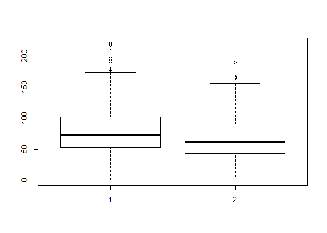
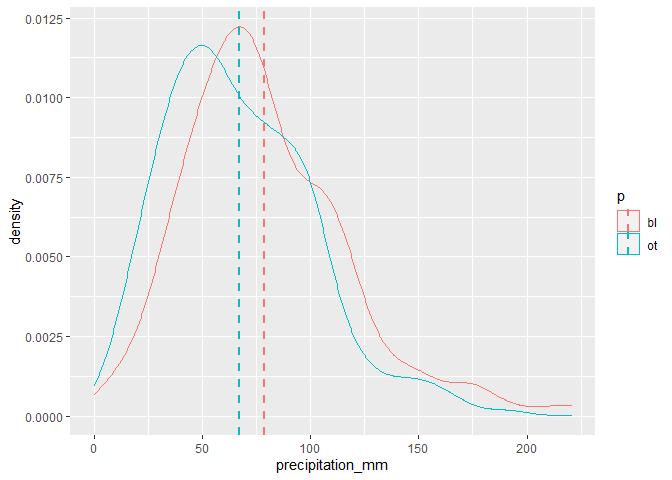
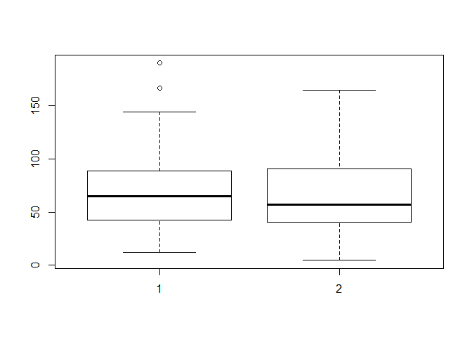
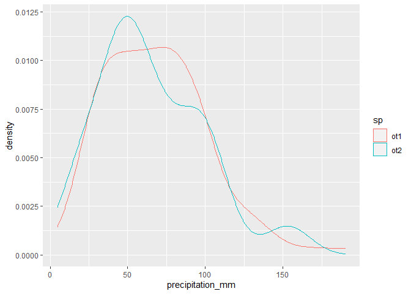
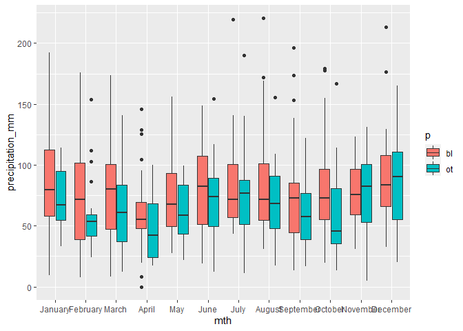
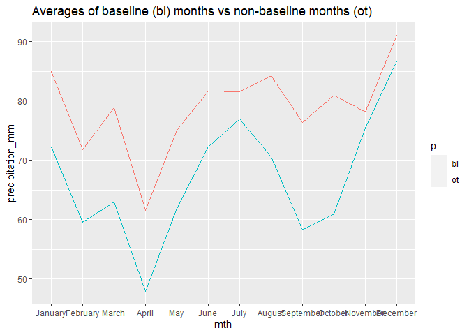

How precipitation
================
dario masante
11 June 2020

The following picture of SPI 48, filtering out a lot of short and mid-term variability, captured my attention. It is quite suspect that the SPI is floating around normal as expected within the baseline, while out of it it gets to crazy negative values... So crazy it's hard to believe they repeat at only 50 years distance (70ies and 20ies) 

So let's check if overall monthly **precipitation** averages are roughly the same between baseline (bl) period and outside (ot). I'd expect not to be very different.

    ## [1] "mean of precip out of baseline: 67.0415879828326"

    ## [1] "mean of precip within baseline: 78.8799722222222"

Quite different averages... Is it statistically significant? (I know distributions aren't normal but it's still ok)

``` r
t.test(bl, ot)
```

    ## 
    ##  Welch Two Sample t-test
    ## 
    ## data:  bl and ot
    ## t = 3.9819, df = 533.17, p-value = 7.786e-05
    ## alternative hypothesis: true difference in means is not equal to 0
    ## 95 percent confidence interval:
    ##   5.998038 17.678731
    ## sample estimates:
    ## mean of x mean of y 
    ##  78.87997  67.04159

``` r
boxplot(bl, ot)
```



Yes it is :( Now view data distributions on a plot

    ## Warning: package 'ggplot2' was built under R version 3.6.3



Definitely looks they are coming from different populations, but should not! Coincidence? t.test suggests extremely unlilkely, they truly seem to be from different pop.

One may say "yes but just like temperatures precipitation may have changed over the course of time". First, that'd be concerning because entails the baseline is not suited anymore. Second it's not the case, since both before and after the baseline are different. Let's double check 2010 to 2020 is equal to 1970-1980:

    ## 
    ##  Welch Two Sample t-test
    ## 
    ## data:  ot1 and ot2
    ## t = 0.67629, df = 228.83, p-value = 0.4995
    ## alternative hypothesis: true difference in means is not equal to 0
    ## 95 percent confidence interval:
    ##  -5.739852 11.739068
    ## sample estimates:
    ## mean of x mean of y 
    ##  68.49633  65.49673



No hints they're different. The number of samples is decent, so they truly seem to have same average, despite shape not so much the same, but that's another problem really

### Month by month

Let's see which months if any in particular are screwing up things

``` r
csv$mth <- factor(month.name[rep(1:12, length.out=nrow(csv))],levels=month.name)
ggplot(csv, aes(x = mth, y = precipitation_mm, fill = p)) + geom_boxplot()
```



``` r
ggplot(csv, aes(x = mth, y = precipitation_mm, fill = p)) + 
  stat_summary(
    fun = mean,
    geom = 'line',
    aes(group = p, colour = p)
  ) + labs(title='Averages of baseline (bl) months vs non-baseline months (ot)')
```



Well, this one is quite explicit.
